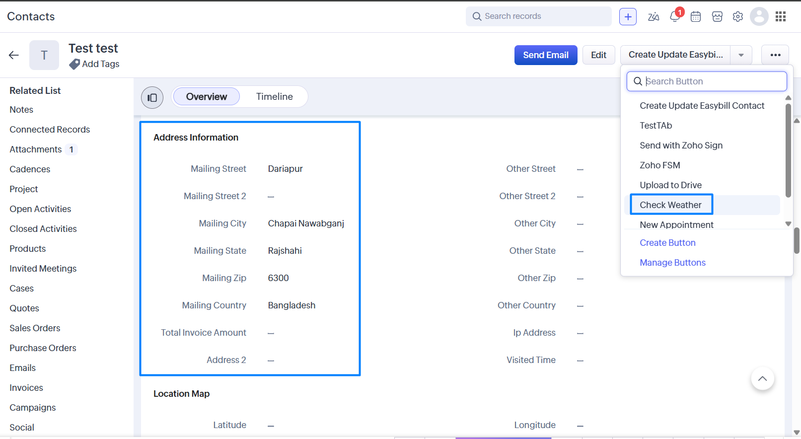
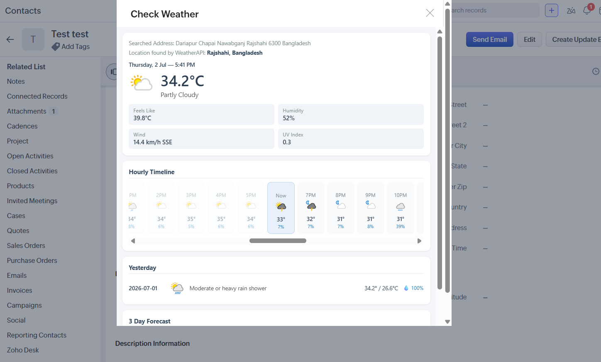
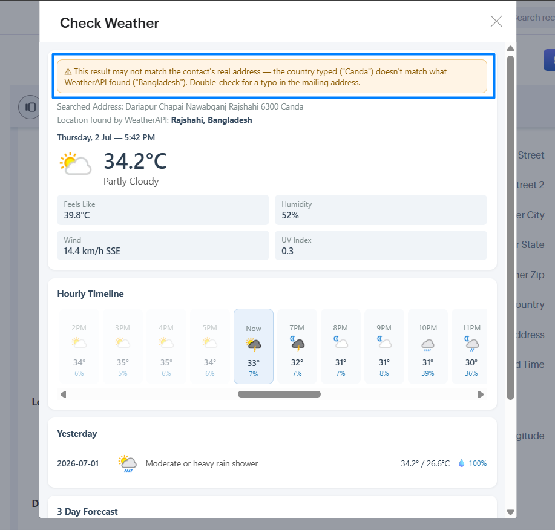

# Zoho CRM – Contact Weather Widget

A Zoho CRM extension that shows a live weather forecast (current conditions,
48‑hour timeline, yesterday's weather, and a 3‑day forecast) for a **Contact's
mailing address**, right inside the Contact's detail page.

It's powered by [WeatherAPI.com](https://www.weatherapi.com/) and built with:

- A **Deluge custom function** (`functions/get_weather_details.dg`) that reads
  the contact's mailing address and calls the WeatherAPI `forecast` and
  `history` endpoints.
- A **Widget** (`app/widget.html`), embedded via the Zoho Embedded App SDK,
  that calls the function and renders the result.


---

## ⚠️ About the API key

The original version of this script had the WeatherAPI key hardcoded directly
in the Deluge function. **That key has been removed from this repository.**

Instead, the function pulls the key at runtime from a **Zoho CRM Variable**
using `zoho.crm.getOrgVariable("weatherapi_key")`. This means:

- No secret ever gets committed to Git / GitHub.
- You can rotate the key from CRM Setup without touching code.
- Anyone who clones this repo must configure their **own** key before it works.

See [Setting up the API key](#4-set-up-the-weatherapi-key-securely) below.

---

## Screenshots

<!-- Add your screenshots to the docs/ folder using the exact filenames below -->

**1. Contact record — mailing address fields with the widget visible**


**2. Weather information (current conditions / hourly / forecast)**


**3. Country / address mismatch warning**


---

## Repository structure

```
zoho-crm-contact-weather-extension/
├── app/
│   ├── widget.html                # The widget UI shown on the Contact page
│   ├── ZohoEmbededAppSDK.min.js   # Zoho's embedded app SDK (vendored)
│   └── translations/
│       └── en.json
├── functions/
│   └── get_weather_details.dg     # Deluge custom function (key removed)
├── docs/                          # Screenshots / extra docs (optional)
├── LICENSE
└── README.md
```

> Note: A Zoho CRM extension package also normally includes a
> `plugin-manifest.json` and a folder structure generated by the
> [Extension SDK](https://www.zoho.com/creator/help/extension/setting-up-extension.html)
> or the Zoho Developer Console. Those aren't part of this repo because they
> are generated per-account when you create the extension (see Step 1 below).
> This repo holds the **source code** you paste/upload into that scaffold.

---

## How it works

1. The widget loads on a Contact's detail page and reads the `EntityId`
   (the contact's record ID) from the CRM page context.
2. It calls the `get_weather_details` Deluge function, passing `contactId`.
3. The function:
   - Fetches the Contact record and builds an address string from the
     Mailing Street/City/State/Zip/Country fields.
   - Fetches the WeatherAPI key from a CRM Variable.
   - Calls WeatherAPI's `forecast.json` (3‑day forecast + current conditions)
     and `history.json` (yesterday's weather).
   - Returns everything as a single JSON map.
4. The widget renders current conditions, a 48‑hour hourly strip, yesterday's
   weather, and the 3‑day forecast — and flags a warning if the country
   WeatherAPI resolved doesn't match the country typed on the contact record
   (a handy way to catch address typos).

---

## Step-by-step setup guide

### 1. Create the extension in Zoho Developer Console

1. Go to the [Zoho Developer Console](https://api-console.zoho.com/) →
   **Extensions** → **Create Extension**.
2. Choose **Zoho CRM** as the service and give it a name, e.g.
   `Contact Weather`.
3. This scaffolds an extension project with its own `plugin-manifest.json`
   and folder structure (Widgets, Functions, Connections, etc.) inside the
   Zoho web-based extension editor (or the CLI/Extension SDK, if you use that
   workflow).

### 2. Add the custom function

1. In the extension editor, go to **Functions** → **Create Function** →
   **Standalone Function**, name it `get_weather_details`.
2. Copy the contents of [`functions/get_weather_details.dg`](functions/get_weather_details.dg)
   into the Deluge editor.
3. Save the function. Note down its **execution/link name** — Zoho typically
   namespaces it like `yourextension__get_weather_details`. You'll need this
   exact string in the widget code (Step 3).

### 3. Add the widget

1. In the extension editor, go to **Widgets** → **Create Widget**, and choose
   to embed it on the **Contact detail page**.
2. Upload/copy in:
   - `app/widget.html`
   - `app/ZohoEmbededAppSDK.min.js`
   - `app/translations/en.json`
3. Open `widget.html` and update this line near the bottom to match the
   function link name from Step 2:

   ```js
   var FUNC_NAME = "yourextension__get_weather_details";
   ```

### 4. Set up the WeatherAPI key securely

1. Get a free API key from [weatherapi.com](https://www.weatherapi.com/).
2. In Zoho CRM go to **Setup → Developer Hub → Variables** (in some
   accounts this is under **Setup → Customization → Variables**).
3. Create a new variable:
   - **API Name:** `weatherapi_key`
   - **Value:** your WeatherAPI key
   - **Type:** Text
4. Save. The Deluge function reads it with:

   ```js
   weatherapi_key = zoho.crm.getOrgVariable("weatherapi_key");
   ```

   No key ever needs to be pasted into the function or committed to Git.

   > Alternative: if your Zoho plan/setup doesn't expose CRM Variables to
   > standalone functions, you can instead create a
   > [Connection](https://www.zoho.com/deluge/help/connections.html) of type
   > "Custom Service" with the key stored as a connection parameter, and
   > reference it in the `invokeurl` blocks with `connection:"your_connection_name"`.

### 5. Give the function permission to call the internet

Make sure the extension's function has the **"Allow Connections to
External Sites"** / URL access permission enabled for
`api.weatherapi.com` when prompted during save (Zoho asks for this the
first time a function calls an external URL).

### 6. Test

1. Open any Contact record that has a Mailing Address filled in.
2. The widget panel should show a spinner, then the current conditions,
   hourly timeline, yesterday's weather, and 3-day forecast.
3. If something goes wrong, open the browser console on the Contact page —
   the widget logs the raw function response there.

### 7. Package and publish (optional)

If you want to distribute the extension:

1. In the Developer Console, use **Pack** to generate the installable
   `.zip` extension package.
2. Publish privately to your own org, or submit it to the Zoho Marketplace
   review process if you want to distribute it publicly.

---

## Publishing this project to GitHub

If you're doing this for the first time, here's the full flow from your
local machine:

```bash
# 1. Create a new repo on GitHub first (via github.com → New repository),
#    e.g. named "zoho-crm-contact-weather-extension". Don't initialize it
#    with a README (you already have one here).

# 2. From inside this project folder:
cd zoho-crm-contact-weather-extension
git init
git add .
git commit -m "Initial commit: contact weather widget + Deluge function"
git branch -M main

# 3. Point it at your GitHub repo (replace with your actual repo URL)
git remote add origin https://github.com/<your-username>/zoho-crm-contact-weather-extension.git

# 4. Push
git push -u origin main
```

**Before your first push**, double-check with `git status` and
`git diff --staged` that no real API key, contact data, or org-specific IDs
are staged. This repo's `.gitignore` already excludes common secret file
patterns (`.env`, `secrets.dg`, `*.key`), but it's worth a manual look the
first time.

---

## Security checklist before making the repo public

- [ ] No hardcoded API keys anywhere in `.dg` or `.html` files (this repo's
      function already reads the key from a CRM Variable).
- [ ] No real contact/customer data, record IDs, or org IDs left in example
      code or screenshots.
- [ ] `FUNC_NAME` in `widget.html` uses a placeholder/your own extension's
      link name, not a private internal one you don't want exposed (this is
      low-risk since it's just a function name, but worth reviewing).
- [ ] Rotate the WeatherAPI key if it was ever committed anywhere previously
      (it appears to have been shared in plain text before — treat that
      original key as compromised and generate a new one from your
      WeatherAPI.com dashboard).

---

## License

MIT — see [LICENSE](LICENSE).

## Author
Built by Shahriar Khan Limon(https://github.com/ShahriarKhanLimon)